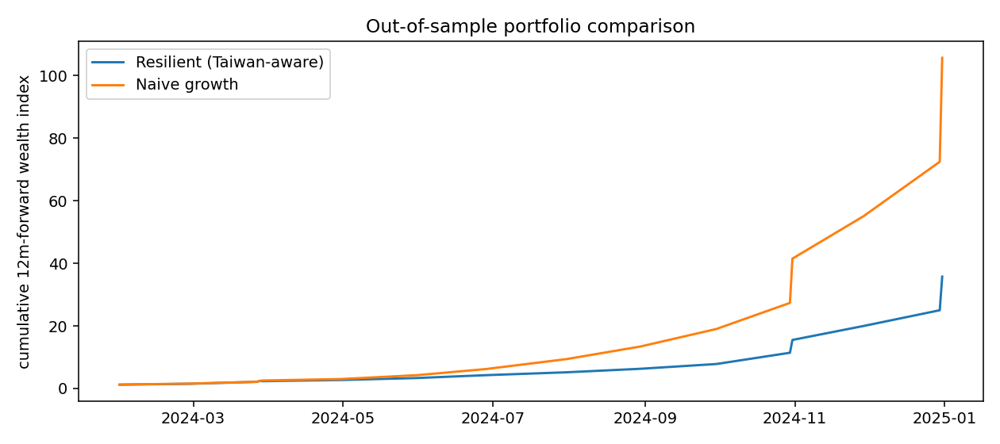
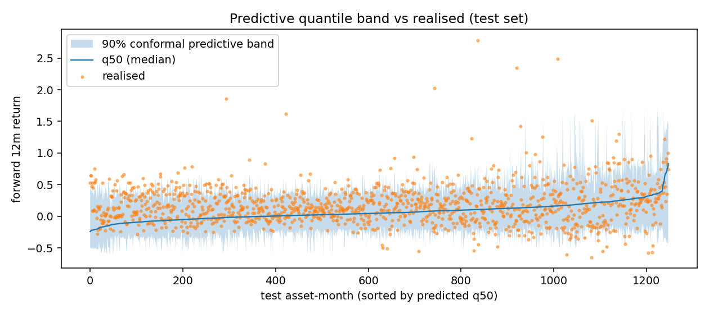

# Resilient Cross-Asset Portfolio

This repository presents a DTU Advanced Business Analytics group project on stress-aware portfolio construction. The project builds a cross-asset allocation workflow that asks a practical question: which assets still look acceptable if a named geopolitical disruption occurs?

**Main result:** in the live-data test window, the resilient portfolio gave up realised return versus a growth-only benchmark, but improved the Taiwan-scenario 5% downside forecast from -21.7% to -16.2%. The value of the approach is therefore scenario resilience, not unconditional benchmark outperformance.

## Final Deliverable

The main deliverable is the exported HTML technical report:

- [technical_report.html](technical_report.html)
- [Executive summary PDF](docs/executive_summary.pdf)
- [Executed notebook](notebooks/technical_report.ipynb)

GitHub does not always render HTML files directly in the file viewer. After uploading, the cleanest way to show the report to recruiters is to enable GitHub Pages so the report opens as a normal webpage.

## Business Question

Can a portfolio be re-weighted before a defined geopolitical disruption so that it balances expected return with downside resilience under that scenario?

The primary disruption scenario is a Taiwan Strait / TSMC supply shock. The project also includes an emerging-market dollar-squeeze scenario as a contrast.

## Methods

The project combines several Advanced Business Analytics methods:

- Cross-asset universe construction across stocks, country ETFs and commodities
- Monthly feature engineering from market, fundamental and macro-governance data
- Ensemble learning with random forest and gradient boosting models
- Quantile regression for prediction uncertainty
- Counterfactual scenario stress testing
- Portfolio scoring with a downside-resilience penalty
- SHAP-based model interpretation
- Country-risk clustering as a macro-financial robustness check

## Key Findings

- The universe contains 104 assets across equities, country ETFs and commodities.
- Split-conformal calibration improved validation interval coverage to 90.1%, while test coverage remained 81.5%.
- The growth-only benchmark produced higher realised test-window returns: 34.5% versus 25.6% for the resilient portfolio.
- The resilient portfolio improved the Taiwan-scenario 5% tail forecast: -16.2% versus -21.7% for the growth benchmark.
- SHAP attribution indicates that scenario-sensitive features such as volatility, drawdown and political-stability context drive the stressed forecasts.

## Selected Figures






## Repository Structure

```text
.
|-- README.md
|-- index.html
|-- technical_report.html
|-- docs/
|   |-- executive_summary.md
|   `-- executive_summary.pdf
|-- notebooks/
|   `-- technical_report.ipynb
|-- figures/
|   |-- country_risk_map.png
|   |-- portfolio_cumulative.png
|   |-- quantile_band.png
|   |-- scenario_impact_by_country.png
|   `-- shap_family_decomposition.png
|-- outputs/
|   |-- average_resilient_portfolio_test_window.csv
|   |-- final_resilient_portfolio_latest.csv
|   `-- portfolio_weights_full.csv
`-- data/
    `-- README.md
```

## How To View The Project

For a quick review:

1. Read this README.
2. Open [technical_report.html](technical_report.html) or use the GitHub Pages link after Pages is enabled.
3. Check [docs/executive_summary.pdf](docs/executive_summary.pdf) for the one-page business summary.
4. Inspect [outputs/final_resilient_portfolio_latest.csv](outputs/final_resilient_portfolio_latest.csv) for the final portfolio allocation.

## Reproducibility Note

This is a presentation-first GitHub version. The original development folder contains a larger and messier codebase with cached data, model artifacts and rebuild scripts. This public version keeps the final executed HTML report, the executed notebook, selected figures and output CSVs so that recruiters can understand the project quickly.

The results should be treated as a static academic-project snapshot. Live financial data, provider access and scenario assumptions can change.

## Limitations

This is an academic group project, not an investment product. The stress scenario is a transparent counterfactual assumption rather than an identified causal effect. No actual Taiwan Strait shock occurs in the test window, so realised backtest performance and scenario resilience measure different objectives. The model is useful for explaining a decision-support workflow, not for production portfolio management.

## Contribution And AI Use

This repository is based on a group project completed for DTU 42578 Advanced Business Analytics. It is presented as evidence of applied analytics, machine learning, uncertainty modelling, scenario analysis and decision-support communication, without claiming sole authorship or production-level portfolio engineering.

The public GitHub version was organised and documented with AI assistance. The original project materials also note that AI assistance was used to support code structure, debugging and wording, with final analysis and interpretation reviewed by the group.
