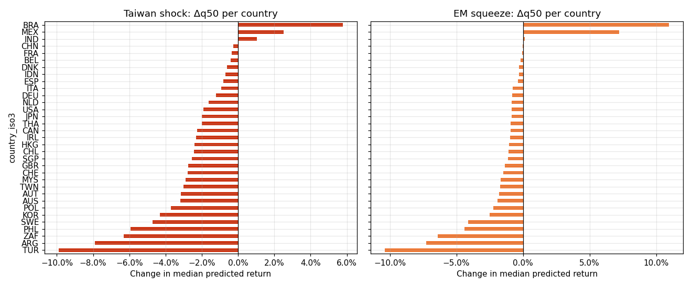
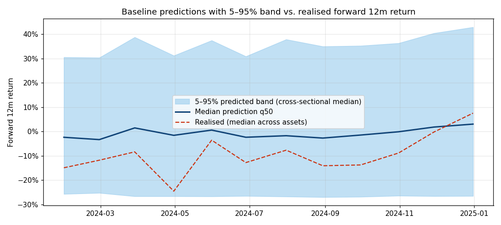
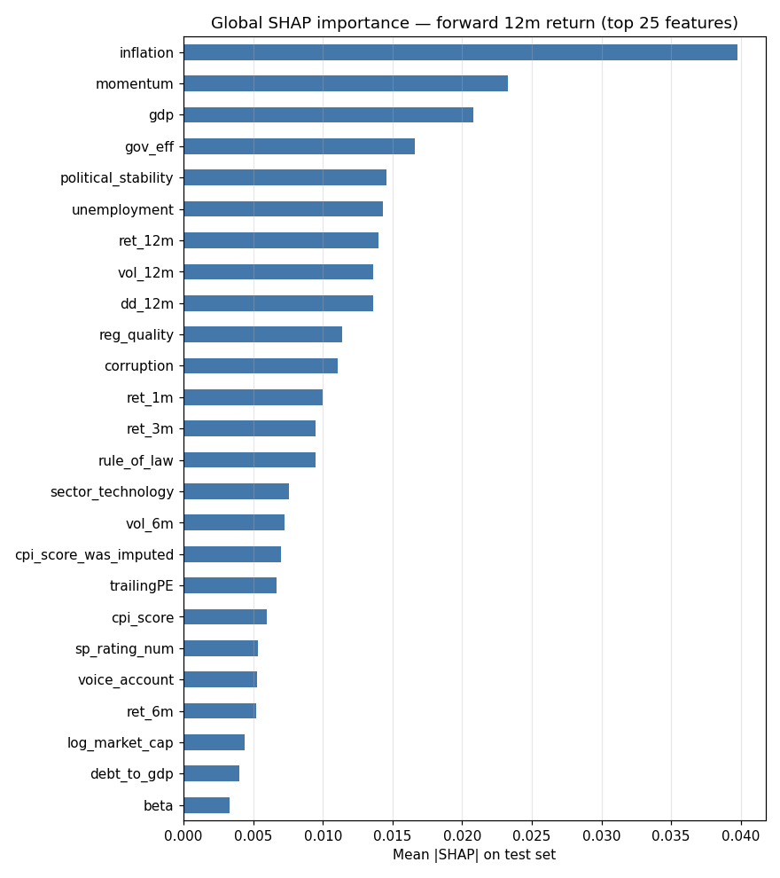

# Resilient Cross-Asset Portfolio

This is a DTU Advanced Business Analytics group project on stress-aware portfolio construction.

The final deliverable is the exported HTML report:

**View as a webpage:** https://joaodso.github.io/resilient-cross-asset-portfolio/

## Main Result

In the test window, the resilient portfolio gave up realised return compared with a growth-only benchmark, but improved the Taiwan-scenario downside forecast:

- Realised forward return: 25.6% resilient vs 34.5% growth benchmark
- Taiwan-scenario 5% tail forecast: -16.2% resilient vs -21.7% growth benchmark

The point is not to claim unconditional outperformance. The point is to show a transparent decision-support workflow for stress-aware allocation.

## Key Figures

The scenario analysis compares country-level shifts in median predicted returns under the Taiwan Strait / TSMC shock and an emerging-market dollar-squeeze scenario.

The quantile model shows uncertainty around the median return forecast and compares it with realised forward 12-month returns.

The SHAP summary highlights the main drivers used by the model, including inflation, momentum, GDP, governance effectiveness and political stability.

## Project Idea

Most portfolios are built around expected return in normal conditions. This project asks a more practical risk question:

**Can we build a cross-asset portfolio that remains more resilient under a named geopolitical disruption?**

The main scenario is a Taiwan Strait / TSMC supply shock.

## What The Project Shows

- Cross-asset universe design across stocks, country ETFs and commodities
- Machine-learning return prediction using ensemble models
- Quantile regression for uncertainty and downside-risk estimates
- Counterfactual scenario stress testing
- Portfolio weighting based on baseline return, stressed return and downside exposure
- SHAP-based interpretation of model drivers

## Report Highlights

- [Data universe](https://joaodso.github.io/resilient-cross-asset-portfolio/#2.-Data): 104 instruments across stocks, country ETFs and commodities.
- [Disruption scenarios](https://joaodso.github.io/resilient-cross-asset-portfolio/#7.-Counterfactual-disruption-scenarios): Taiwan Strait / TSMC supply shock plus an emerging-market dollar-squeeze comparison.
- [Portfolio allocation](https://joaodso.github.io/resilient-cross-asset-portfolio/#8.-Resilient-portfolio-score-and-allocation): weights built from baseline return, stressed return and downside exposure.
- [Conclusions](https://joaodso.github.io/resilient-cross-asset-portfolio/#12.-Conclusions): the result is a resilience trade-off, not a claim of investment outperformance.

## Files

- `index.html` - final exported report with methods, outputs and figures
- `figures/` - three selected charts used for the GitHub preview
- `README.md` - short recruiter-facing overview

## Limitations

This is an academic group project, not an investment product. Scenario magnitudes are assumptions rather than identified causal effects. The results should be read as a decision-science and analytics exercise, not as financial advice.

## Contribution And AI Use

This repository is based on a group project completed for DTU 42578 Advanced Business Analytics. It is presented as evidence of applied analytics, machine learning, uncertainty modelling and decision-support communication, without claiming sole authorship or production-level portfolio engineering.

The public GitHub version was simplified and documented with AI assistance.
